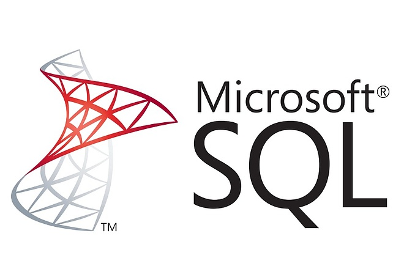
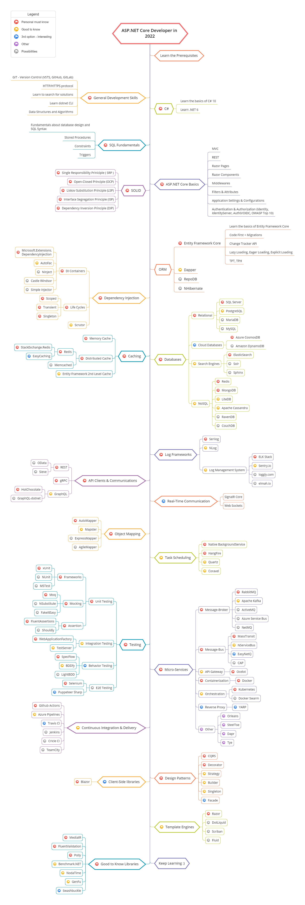

# .NET Core Developer Roadmap

## Stages
| Stage         | Description        | Technologies | Completed |
|:-------------:|:------------------:|:------------:|:---------:|
| 1 | **Minimal infrastructure for .Net app** |  | ✅ |
| 2 | **Entity Framework Core**  with  **Microsoft SQL** |  | ✅ |
| 3 | **Docker** and **GitHub Actions** |    | ❌ |
| 4 | **Logging** |  | ❌ |
| 5 | **Tests**   |  | ❌ |

## Full roadmap

